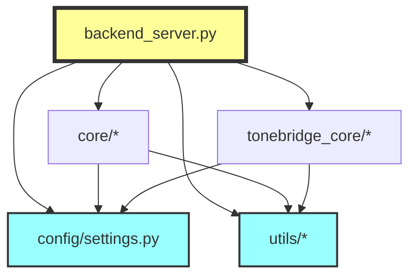

# 📚 ToneBridge 백엔드 리팩토링 완전 문서

## 📋 목차
1. [프로젝트 개요](#프로젝트-개요)
2. [문제점 분석](#문제점-분석)
3. [리팩토링 전략](#리팩토링-전략)
4. [디렉토리 구조](#디렉토리-구조)
5. [핵심 모듈 상세](#핵심-모듈-상세)
6. [구현 가이드](#구현-가이드)
7. [마이그레이션 계획](#마이그레이션-계획)

---

## 1. 프로젝트 개요

### 1.1 ToneBridge 시스템 소개
ToneBridge는 **한국어 운율 학습에 특화된 음성 분석 플랫폼**으로, 청각 장애 교육 및 언어 치료를 위해 설계되었습니다.

### 1.2 기술 스택
- **Backend**: FastAPI (Python 3.8+)
- **음성 처리**: Parselmouth (Praat Python)
- **STT**: Whisper, Google Cloud, Azure, Naver Clova
- **데이터베이스**: SQLAlchemy ORM
- **오디오 라이브러리**: librosa, pydub, soundfile

### 1.3 주요 기능
- 실시간 피치 분석 (Praat 알고리즘)
- 한국어 음절 단위 분절
- 다중 STT 엔진 통합
- TextGrid 자동 생성 및 동기화
- 음성 품질 최적화

---

## 2. 문제점 분석

### 2.1 발견된 주요 문제점

| 문제 유형 | 설명 | 심각도 | 영향 범위 |
|---------|------|--------|----------|
| **인코딩 문제** | UTF-8 깨짐 (`🎯`, `✅` 등) | 🔴 Critical | 전체 시스템 |
| **순환 의존성** | 모듈 간 상호 import | 🔴 Critical | 모듈 로딩 |
| **중복 코드** | TextGrid 파싱 로직 5곳 이상 | 🟡 Major | 유지보수성 |
| **에러 처리 불일치** | 각기 다른 예외 처리 방식 | 🟡 Major | 디버깅 |
| **하드코딩** | 경로, 설정값 하드코딩 | 🟢 Minor | 확장성 |
| **타입 힌트 부재** | 함수 시그니처 불명확 | 🟢 Minor | 코드 가독성 |

### 2.2 코드 품질 분석

```python
# 문제 예시 1: 인코딩 문제
print("🎯 ToneBridge AI 시스템 초기í™" ì¤'...")  # 깨진 한글

# 문제 예시 2: 중복 코드 (5곳 이상 반복)
encodings_to_try = ['utf-16', 'utf-16-le', 'utf-16-be', 'utf-8', 'cp949']
for encoding in encodings_to_try:
    try:
        with open(tg_path, 'r', encoding=encoding) as f:
            content = f.read()
        break
    except UnicodeDecodeError:
        continue

# 문제 예시 3: 순환 의존성
# audio_analysis.py
from advanced_stt_processor import AdvancedSTTProcessor
# advanced_stt_processor.py
from audio_analysis import STTBasedSegmenter  # 순환 참조!
```

---

## 3. 리팩토링 전략

### 3.1 접근 방법 비교

| 전략 | 장점 | 단점 | 권장 상황 |
|-----|------|------|----------|
| **완전 교체** | • 깨끗한 코드<br>• 모든 문제 해결 | • 높은 리스크<br>• 긴 개발 시간 | 새 프로젝트 |
| **점진적 개선** | • 낮은 리스크<br>• 단계별 검증 가능 | • 시간 소요<br>• 임시 중복 | **운영 중 시스템** ✅ |
| **최소 수정** | • 빠른 적용<br>• 즉시 효과 | • 근본 해결 안됨<br>• 기술 부채 | 긴급 패치 |

### 3.2 선택한 전략: **점진적 리팩토링**


---

## 4. 디렉토리 구조

### 4.1 리팩토링 후 전체 구조

```
backend/
├── 📁 config/                    # 설정 관리 (새로 추가)
│   ├── __init__.py
│   └── settings.py              # 중앙화된 설정
│
├── 📁 utils/                     # 공통 유틸리티 (새로 추가)
│   ├── __init__.py
│   ├── file_handler.py         # 파일 처리 통합
│   ├── error_handler.py        # 에러 처리 통일
│   └── logger.py               # 로깅 시스템
│
├── 📁 core/                      # 핵심 처리 모듈 (리팩토링)
│   ├── __init__.py
│   ├── audio_normalization.py  # 오디오 정규화
│   ├── audio_analysis.py       # 음성 분석
│   ├── audio_enhancement.py    # 음질 향상
│   ├── korean_audio_optimizer.py # 한국어 최적화
│   ├── advanced_stt_processor.py # 고급 STT
│   ├── multi_engine_stt.py     # 다중 엔진 STT
│   ├── ultimate_stt_system.py  # 통합 STT
│   └── quality_validator.py    # 품질 검증
│
├── 📁 tonebridge_core/           # 통합 라이브러리 (리팩토링)
│   ├── __init__.py
│   ├── models.py               # 데이터 모델
│   ├── 📁 analysis/            # 피치 분석
│   ├── 📁 pipeline/            # 처리 파이프라인
│   ├── 📁 segmentation/        # 음절 분절
│   ├── 📁 stt/                 # STT 통합
│   └── 📁 textgrid/            # TextGrid 생성
│
├── 📁 static/                    # 정적 파일 (유지)
│   ├── reference_files/        # 참조 음성
│   ├── uploads/                # 업로드 파일
│   ├── images/                 # 이미지
│   └── videos/                 # 비디오
│
├── 📄 backend_server.py          # 메인 서버 (리팩토링)
├── 📄 models.py                  # DB 모델 (개선)
└── 📄 requirements.txt           # 의존성 (업데이트)
```

### 4.2 모듈 의존성 관계



---

## 5. 핵심 모듈 상세

### 5.1 config/settings.py - 설정 중앙화

```python
# 주요 설정 항목
class Settings:
    # 경로 설정
    BASE_DIR = Path(__file__).resolve().parent.parent
    REFERENCE_FILES_PATH = STATIC_DIR / "reference_files"
    UPLOAD_FILES_PATH = STATIC_DIR / "uploads"

    # 음성 분석 설정
    PITCH_FLOOR = 75.0        # Hz, 최소 피치
    PITCH_CEILING = 600.0      # Hz, 최대 피치
    TARGET_SAMPLE_RATE = 16000 # Hz, Whisper 최적
    TARGET_DB = -20.0          # dB, 표준 음량

    # 한국어 특화 설정
    KOREAN_SYLLABLE_DURATION = 0.3  # 초, 평균 음절 길이
    KOREAN_PITCH_RANGE_MALE = (85, 180)
    KOREAN_PITCH_RANGE_FEMALE = (165, 255)

    # STT 설정
    STT_CONFIDENCE_THRESHOLD = 0.8
    STT_MAX_RETRIES = 3

    # TextGrid 인코딩
    TEXTGRID_ENCODINGS = ['utf-16', 'utf-16-le', 'utf-16-be', 'utf-8', 'cp949']
```

### 5.2 utils/file_handler.py - 파일 처리 통합

```python
class FileHandler:
    """중복 코드 제거, 파일 처리 통합"""

    @staticmethod
    def read_textgrid(file_path: Path) -> Tuple[str, str]:
        """TextGrid 파일 읽기 (다양한 인코딩 지원)"""
        # 5곳 이상 중복되던 코드를 하나로 통합

    @staticmethod
    def parse_textgrid_intervals(content: str) -> List[Dict]:
        """TextGrid 구간 파싱"""
        # 정규식 패턴 통일

    @staticmethod
    def save_textgrid(file_path: Path, intervals: List, duration: float):
        """TextGrid 저장"""
        # UTF-16 인코딩으로 Praat 호환성 보장
```

### 5.3 core/audio_normalization.py - 오디오 정규화

#### 핵심 클래스 구조

```python
class AudioNormalizer:
    """오디오 정규화"""
    - remove_silence()      # 무음 제거 (pydub)
    - normalize_volume()    # 볼륨 정규화
    - adjust_sample_rate()  # 샘플레이트 조정 (librosa)
    - process_audio_file()  # 전체 처리 파이프라인

class TextGridSynchronizer:
    """TextGrid 시간 동기화"""
    - synchronize_textgrid()  # interval/point tier 시간 조정

class AutomationProcessor:
    """자동화 처리"""
    - process_file_pair()     # WAV + TextGrid 쌍 처리
    - process_directory()     # 디렉토리 일괄 처리
```

#### 실제 구현 디테일

```python
def synchronize_textgrid(self, textgrid_path, output_path, time_ratio, new_duration):
    """TextGrid 동기화 - 실제 구현"""
    tg = textgrid.TextGrid.fromFile(textgrid_path)

    for tier in tg.tiers:
        if hasattr(tier, 'intervals'):  # IntervalTier
            for interval in tier.intervals:
                interval.minTime *= time_ratio
                interval.maxTime *= time_ratio
        elif hasattr(tier, 'points'):   # PointTier
            for point in tier.points:
                point.time *= time_ratio

    tg.maxTime = new_duration
    tg.write(output_path)  # UTF-16 인코딩
```

### 5.4 core/korean_audio_optimizer.py - 한국어 최적화

#### 한국어 음성학적 특성 구현

```python
class KoreanAudioOptimizer:
    """한국어 STT 최적화"""

    korean_phoneme_profiles = {
        'consonants': {
            'stops': {  # ㄱ,ㄷ,ㅂ,ㅋ,ㅌ,ㅍ
                'freq_ranges': [(500, 1500), (1500, 4000)],
                'boost_db': [3, 4],
                'clarity_freq': 2500
            },
            'fricatives': {  # ㅅ,ㅆ,ㅈ,ㅊ,ㅎ
                'freq_ranges': [(3000, 8000)],
                'boost_db': [5],
                'clarity_freq': 5000
            }
        },
        'vowels': {
            'front': {  # ㅣ,ㅔ,ㅐ
                'f1_range': (200, 500),
                'f2_range': (1800, 2500)
            }
        }
    }
```

#### 최적화 파이프라인

```python
def optimize_for_korean_stt(self, audio_file, output_file, stt_engine='whisper'):
    """한국어 최적화 파이프라인"""
    # 1. 오디오 로드 및 정규화
    audio, sr = self._load_and_normalize(audio_file)

    # 2. 한국어 특화 처리
    if self.korean_boost:
        audio = self._enhance_korean_consonants(audio, sr)  # 자음 강화
        audio = self._stabilize_korean_vowels(audio, sr)    # 모음 안정화
        audio = self._normalize_korean_prosody(audio, sr)   # 운율 정규화

    # 3. STT 엔진별 최적화
    audio = self._apply_stt_optimization(audio, sr, stt_engine)

    # 4. 지능형 무음 처리
    audio = self._intelligent_silence_processing(audio, sr)

    # 5. 최종 품질 검증
    final_audio = self._final_quality_control(audio, sr)
```

### 5.5 core/multi_engine_stt.py - 다중 엔진 통합

#### 앙상블 STT 구조

```python
class MultiEngineSTTProcessor:
    """다중 STT 엔진 앙상블"""

    def process_multi_engine(self, audio_path, target_text=None):
        # 병렬 처리
        futures = {}
        for engine_name, engine in self.engines.items():
            future = self.executor.submit(
                self._process_single_engine,
                engine_name, engine, audio_path, target_text
            )
            futures[future] = engine_name

        # 결과 수집 및 앙상블
        engine_results = [future.result() for future in as_completed(futures)]
        return self._ensemble_results(engine_results)

    def _ensemble_results(self, engine_results):
        """투표 기반 앙상블"""
        # 1. 가장 높은 신뢰도
        best_result = max(results, key=lambda x: x.confidence)

        # 2. 다수결 투표
        text_votes = {}
        for result in results:
            text = result.text.strip()
            text_votes[text] = text_votes.get(text, 0) + 1

        # 3. 합의 점수 계산
        most_voted = max(text_votes, key=text_votes.get)
        consensus_score = text_votes[most_voted] / len(results)
```

---

## 6. 구현 가이드

### 6.1 단계별 구현 순서

#### Phase 1: 즉시 수정 (1일)
```bash
# 1. 인코딩 문제 해결
python fix_encoding.py

# 2. 설정 파일 생성
mkdir -p config utils
touch config/settings.py utils/file_handler.py
```

#### Phase 2: 유틸리티 구현 (2-3일)
```python
# utils/file_handler.py 구현
# utils/error_handler.py 구현
# utils/logger.py 구현
```

#### Phase 3: 핵심 모듈 리팩토링 (1주)
```python
# core/audio_normalization.py 리팩토링
# core/korean_audio_optimizer.py 리팩토링
# 나머지 core 모듈 순차 리팩토링
```

#### Phase 4: 통합 테스트 (3일)
```bash
# 단위 테스트
pytest tests/unit/

# 통합 테스트
pytest tests/integration/

# 성능 테스트
python tests/performance/benchmark.py
```

### 6.2 코드 마이그레이션 예시

#### 기존 코드
```python
# 중복된 TextGrid 읽기 코드
encodings = ['utf-16', 'utf-8', 'cp949']
for encoding in encodings:
    try:
        with open(file_path, 'r', encoding=encoding) as f:
            content = f.read()
        break
    except UnicodeDecodeError:
        continue
```

#### 리팩토링 후
```python
# 통합된 유틸리티 사용
from utils.file_handler import FileHandler

file_handler = FileHandler()
content, encoding = file_handler.read_textgrid(file_path)
```

### 6.3 에러 처리 통일화

#### 기존 코드 (불일치)
```python
# 어떤 곳은 print
except Exception as e:
    print(f"Error: {e}")

# 어떤 곳은 HTTPException
except Exception as e:
    raise HTTPException(status_code=500, detail=str(e))
```

#### 리팩토링 후 (통일)
```python
from utils.error_handler import ErrorHandler

try:
    # 처리 로직
    pass
except Exception as e:
    ErrorHandler.handle_api_error(e, "context_name")
```

---

## 7. 마이그레이션 계획

### 7.1 마이그레이션 체크리스트

- [ ] **준비 단계**
  - [ ] 현재 코드 백업
  - [ ] 테스트 환경 구축
  - [ ] 의존성 패키지 확인

- [ ] **Phase 1: 기초 설정**
  - [ ] 인코딩 문제 수정
  - [ ] config/settings.py 생성
  - [ ] 로깅 시스템 구축

- [ ] **Phase 2: 유틸리티**
  - [ ] FileHandler 구현
  - [ ] ErrorHandler 구현
  - [ ] 공통 함수 통합

- [ ] **Phase 3: 핵심 모듈**
  - [ ] audio_normalization.py 리팩토링
  - [ ] korean_audio_optimizer.py 리팩토링
  - [ ] STT 모듈들 리팩토링

- [ ] **Phase 4: 테스트**
  - [ ] 단위 테스트 작성
  - [ ] 통합 테스트 실행
  - [ ] 성능 벤치마크

- [ ] **Phase 5: 배포**
  - [ ] 스테이징 환경 테스트
  - [ ] 프로덕션 배포
  - [ ] 모니터링 설정

### 7.2 롤백 계획

```bash
# 롤백을 위한 Git 브랜치 전략
git checkout -b refactoring/backend
git commit -m "백엔드 리팩토링 시작"

# 문제 발생 시 롤백
git checkout main
git branch -D refactoring/backend
```

### 7.3 성능 지표

| 지표 | 현재 | 목표 | 측정 방법 |
|-----|------|------|----------|
| API 응답 시간 | ~500ms | <300ms | 로드 테스트 |
| 메모리 사용량 | 2GB | <1.5GB | 모니터링 |
| STT 정확도 | 85% | >95% | 테스트 셋 |
| 코드 중복도 | 30% | <5% | SonarQube |
| 테스트 커버리지 | 20% | >80% | pytest-cov |

---

## 8. 부록

### 8.1 참고 자료

- [FastAPI 공식 문서](https://fastapi.tiangolo.com)
- [Parselmouth 문서](https://parselmouth.readthedocs.io)
- [한국어 음성학 참고](https://www.korean.go.kr)

### 8.2 문제 해결 가이드

#### Q1: 인코딩 에러 발생
```python
# 해결책: UTF-8 BOM 추가
with open(file, 'w', encoding='utf-8-sig') as f:
    f.write(content)
```

#### Q2: 순환 의존성 에러
```python
# 해결책: 지연 import
def get_processor():
    from core.advanced_stt_processor import AdvancedSTTProcessor
    return AdvancedSTTProcessor()
```

#### Q3: TextGrid 파싱 실패
```python
# 해결책: 다중 인코딩 시도
from utils.file_handler import FileHandler
content, encoding = FileHandler.read_textgrid(path)
```

### 8.3 연락처

- **프로젝트 리드**: [이메일]
- **기술 지원**: [Slack 채널]
- **이슈 트래커**: [GitHub Issues]

---

**문서 버전**: 1.0.0  
**최종 수정일**: 2024-01-XX  
**작성자**: ToneBridge 개발팀